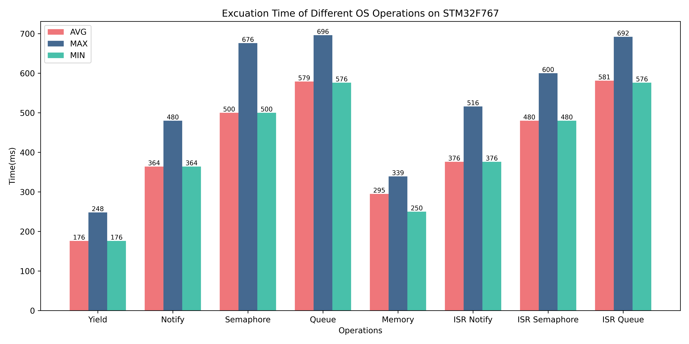
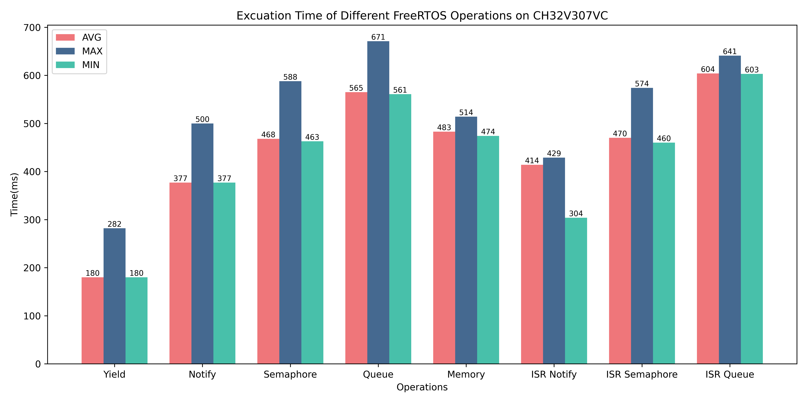

<div align="center">

# FreeRTOS Benchmark

</div>

## Configuration

- FreeRTOS Version: 9.0.0.
- Chips include: **STM32F767IG** and **CH32V307VC**.
- GCC12 and Optimization level: -O3.
- More specific implementation details can be seen from source code.

## Results

### STM32F767IG Benchmark

```
====================================================
Test (number in CPU cycles)        : AVG / MAX / MIN
Yield                              : 176 / 248 / 176
Notification                       : 364 / 480 / 364
Semaphore                          : 500 / 676 / 500
Message queue                      : 578 / 692 / 576
Memory allocation/free pair        : 295 / 333 / 251
ISR Notification                   : 376 / 536 / 376
ISR Semaphore                      : 480 / 616 / 480
ISR Message queue                  : 580 / 676 / 576
```

<div align="center">



</div>

### CH32V307VC Benchmark

```
====================================================
Test (number in CPU cycles)        : AVG / MAX / MIN
Yield                              : 180 / 282 / 180
Notification                       : 377 / 500 / 377
Semaphore                          : 468 / 588 / 463
Message queue                      : 565 / 671 / 561
Memory allocation/free pair        : 483 / 514 / 474
ISR Notification                   : 414 / 429 / 304
ISR Semaphore                      : 470 / 574 / 460
ISR Message queue                  : 604 / 641 / 603
```

<div align="center">



</div>

### Overall

So far, the test result is as follows.

|     Chip     | Yield | Notify | Semphore | Queue | Memory | ISR Notify | ISR Semphore | ISR Queue |
| :----------: | :---: | :----: | :------: | :---: | :----: | :--------: | :----------: | :-------: |
|  STM32F767   |  176  |  364   |   500    |  578  |  295   |    376     |     480      |    580    |
|  CH32V307    |  180  |  377   |   468    |  565  |  483   |    414     |     470      |    604    |
